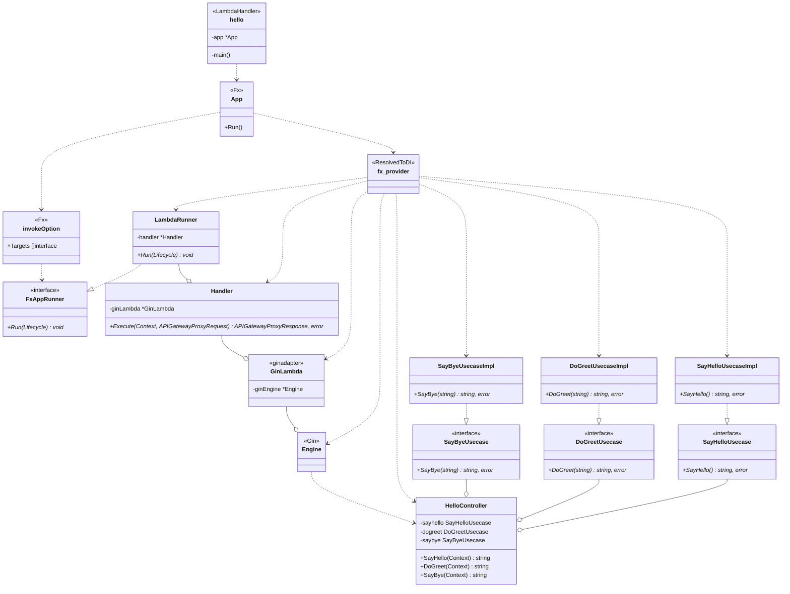

# go-gin-fx-on-lambda-template

Template for building Gin and Fx applications on AWS Lambda.

## Project Structure / プロジェクト構成

```txt
.
├─api
│  └─hello
│      ├─application
│      │  └─usecase
│      ├─configure
│      │  └─fxapp
│      └─presentation
│          ├─controller
│          └─routing
├─fxapp
│  └─runner
│      └─gin
├─lambda
│   ├─adapter
│   ├─handler
│   └─runner
└─go-gin-fx-on-lambda-template-cdk
   ├─bin
   ├─lib
   │  └─resources
   └─test
```

## Class Diagram / クラス図


